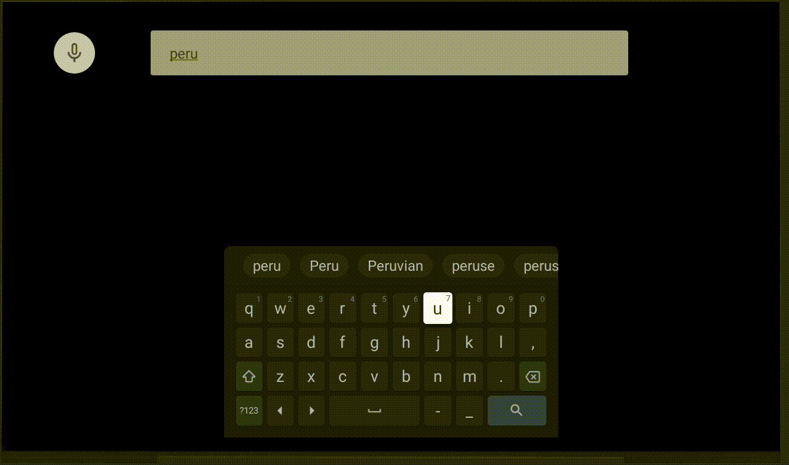
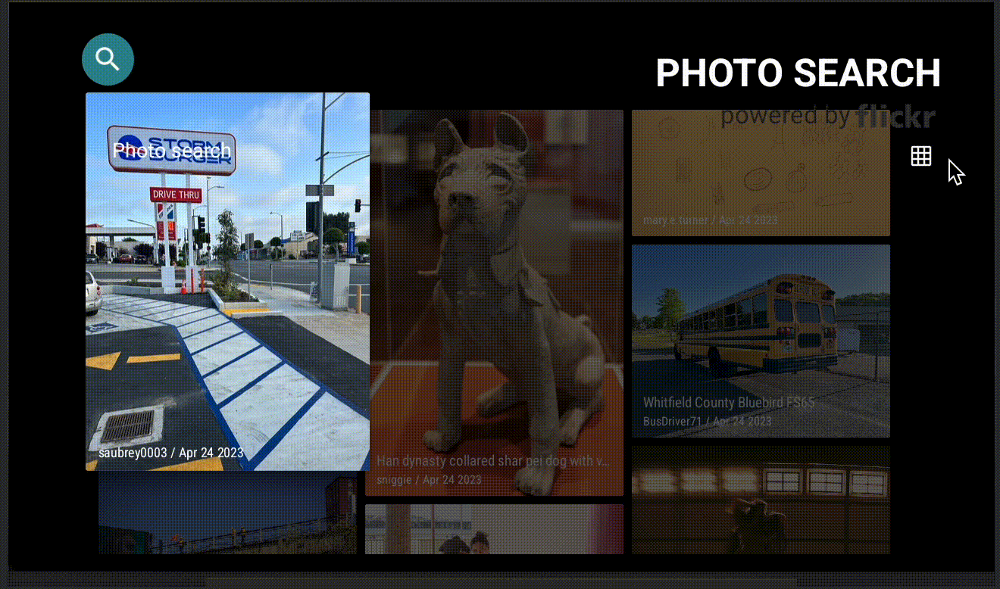

<h3 align="center">Multi Module with Android TV and Compose</h3>

<div align="center">

[]()


[](https://github.com/nowjordanhappy/AndroidTvDemoPlus/issues)
[](https://github.com/nowjordanhappy/AndroidTvDemoPlus/pulls)
[](/LICENSE)

<a href="https://www.buymeacoffee.com/nowjordanhappy" target="_blank"></a>
</div>

# Android TV + Leanback - Multi Module
This is a an android TV demo using Leanback and multi modules. The main idea is showing recent photos and also the ability to search using voice or text.


## Features<a name = "features"></a>

### Main<a name = "features/main"></a>


### Search<a name = "features/search"></a>


### Grid Mode<a name = "features/grid-mode"></a>
Two Modes: fixed and responsive size



### Autoscrolling<a name = "features/autoscrolling"></a>


## Flickr API<a name = "flickr-api"></a>
For testing, you need to create your api key [here](https://www.flickr.com/services/developer/api/) and set it up on the local.properties like this:

```kotlin
FLICKR_API_KEY="XXXXXXXXXXXXXXXXXXXXXXXXXXXXXXXX"
```

## References<a name = "references"></a>
- [Leanback](https://developer.android.com/jetpack/androidx/releases/leanback)
- [Hilt](https://developer.android.com/training/dependency-injection/hilt-android)
- [Flickr API](https://www.flickr.com/services/developer/api/)

## Author<a name = "author"></a>

- Jordan Rojas ([@nowjordanhappy](https://github.com/nowjordanhappy))

## License<a name = "license"></a>

MIT License

Copyright (c) 2024 Jordan R. A.

THE SOFTWARE IS PROVIDED "AS IS", WITHOUT WARRANTY OF ANY KIND, EXPRESS OR  
IMPLIED, INCLUDING BUT NOT LIMITED TO THE WARRANTIES OF MERCHANTABILITY,  
FITNESS FOR A PARTICULAR PURPOSE AND NONINFRINGEMENT. IN NO EVENT SHALL THE  
AUTHORS OR COPYRIGHT HOLDERS BE LIABLE FOR ANY CLAIM, DAMAGES OR OTHER  
LIABILITY, WHETHER IN AN ACTION OF CONTRACT, TORT OR OTHERWISE, ARISING FROM,  
OUT OF OR IN CONNECTION WITH THE SOFTWARE OR THE USE OR OTHER DEALINGS IN THE  
SOFTWARE.